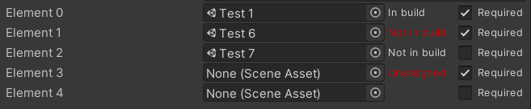

**How to add to a Unity project**

The easiest way is to import the Unity package file "Scene field.unitypackage".

Scene Field
===========

Extension for Unity that allows directly assigning scenes in the Inspector. At runtime, the build index of the scene can be retrieved to, for example, load the scene, without hard-coding or maintaining a list of scene paths. Using this field, the scene info will always be updated even when changing its name, folder, or build index. It's as lightweight as possible, and uses a simple custom inspector:

There are 3 sections in the inspector:

*   The slot with the scene asset, similar to any other asset selector in Unity.
*   A text indicating the build index of the scene. If no scene is selected, "-" will appear, and if the scene is not included in builds, the index "-1" will be shown, with the label in red.
*   A checkbox to enable logging errors in the Unity console if the scene is not included in builds. This is to prevent mistakes, so, when building, the errors will appear in the console if the scene is not going to be added to builds. Unfortunately, in the current version the builds won't be stopped, and when the inspector is visible the log entry will be spammed many times in the console.

The inspector correctly supports editing multiple objects, and the standard bold labels when overriding the fields in prefab instances.

Usage
-----

To add a SceneField to a script, just use the `SceneField` class for the field, which is inside the `Trisibo` namespace:

    using UnityEngine;
    using Trisibo;
    
    public class Test : MonoBehaviour
    {
        [SerializeField] SceneField sceneThingy;
    }

At runtime, you can access the build index of the scene using the `SceneField.BuildIndex` property:

    SceneManager.LoadScene(sceneThingy.BuildIndex);

License
-------

Copyright (C) 2018 Trinidad Sibajas Bodoque

Permission is hereby granted, free of charge, to any person obtaining a copy of this software and associated documentation files (the "Software"), to deal in the Software without restriction, including without limitation the rights to use, copy, modify, merge, publish, distribute, sublicense, and/or sell copies of the Software, and to permit persons to whom the Software is furnished to do so, subject to the following conditions:

The above copyright notice and this permission notice shall be included in all copies or substantial portions of the Software.

THE SOFTWARE IS PROVIDED "AS IS", WITHOUT WARRANTY OF ANY KIND, EXPRESS OR IMPLIED, INCLUDING BUT NOT LIMITED TO THE WARRANTIES OF MERCHANTABILITY, FITNESS FOR A PARTICULAR PURPOSE AND NONINFRINGEMENT. IN NO EVENT SHALL THE AUTHORS OR COPYRIGHT HOLDERS BE LIABLE FOR ANY CLAIM, DAMAGES OR OTHER LIABILITY, WHETHER IN AN ACTION OF CONTRACT, TORT OR OTHERWISE, ARISING FROM, OUT OF OR IN CONNECTION WITH THE SOFTWARE OR THE USE OR OTHER DEALINGS IN THE SOFTWARE.